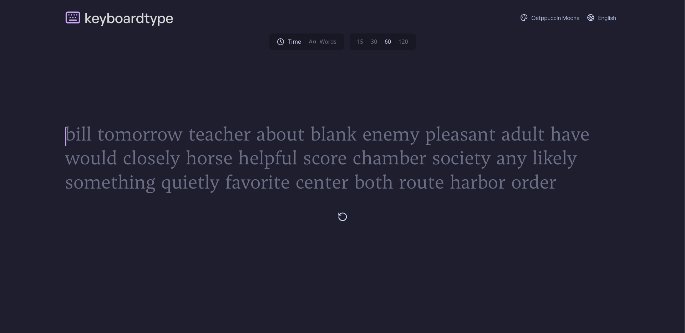

# ⌨️ KeyboardType 
[](./LICENSE)


KeyboardType is a clone website of [monkeytype](https://monkeytype.com) for testing your typing speed, accuracy, and consistency with a set test duration or a specified number of words to be typped.

> [!IMPORTANT]
> Currently, KeyboardType only supports laptop screen sizes ranging from 1280px to 1440px. Running this project outside the specified range may result in:
> - Broken/messy layout
> - Content overflowing off-screen
> - The page appearing overly long

## 🛠️ Features

- 60-second timer for testing typing speed
- A basic statistic showing WPM, Accuracy, Consistency, and Elapsed time
- Highlight in red when a letter is typed incorrectly
- Correctly typed letter will have white highlight otherwise, it will have dimmed highlight.
- Restart or pause in the middle of a test
- Test mode selection (timer and word mode)
- Time duration and word amount selection
- Theme selection
- Saved user preferences

## 💻 Tech Stack

**Client:** React (19.2.8), TailwindCSS (4.3)

**Package:** NPM (11.6.2)

## 📦 Installation

Install KeyboardType project with git and run locally with npm

```bash
  git clone https://github.com/wasyn2025/keyboard-type.git
  cd keyboard-type
  npm install
  npm run dev
```

## 📄 License

[MIT](https://choosealicense.com/licenses/mit/)

