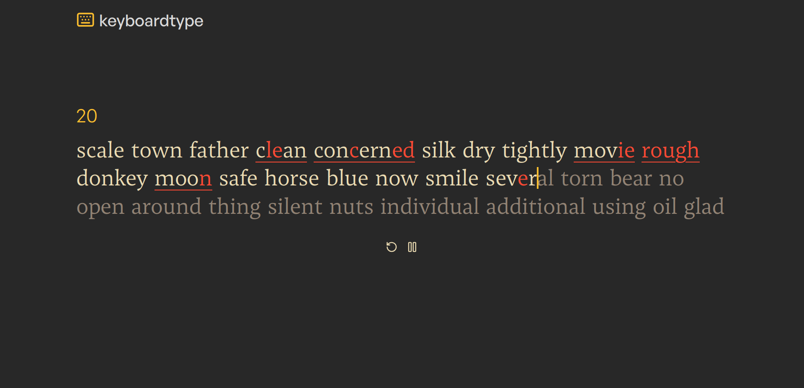

# ⌨️ KeyboardType 



A [monkeytype](https://monkeytype.com) clone website client for testing your typing speed, consistency, and accuracy with minimalist and easy to use interface.

## 🛠️ Features

- 60-second timer for testing typing speed
- A basic counter statistic showing WPM, Accuracy, Consistency, and Elapsed time
- Highlight in red when a letter is typed incorrectly
- Correctly typed letter will have white highlight otherwise, it will have dimmed highlight.
- Restart or pause in the middle of a test

## 💻 Tech Stack

**Client:** React, TailwindCSS

**Package:** NPM

## 📦 Installation

Install KeyboardType project with git and run locally with npm

```bash
  git clone https://github.com/wasyn2025/keyboard-type.git
  cd keyboard-type
  npm install
  npm run dev
```

## 📄 License

[MIT](https://choosealicense.com/licenses/mit/)

